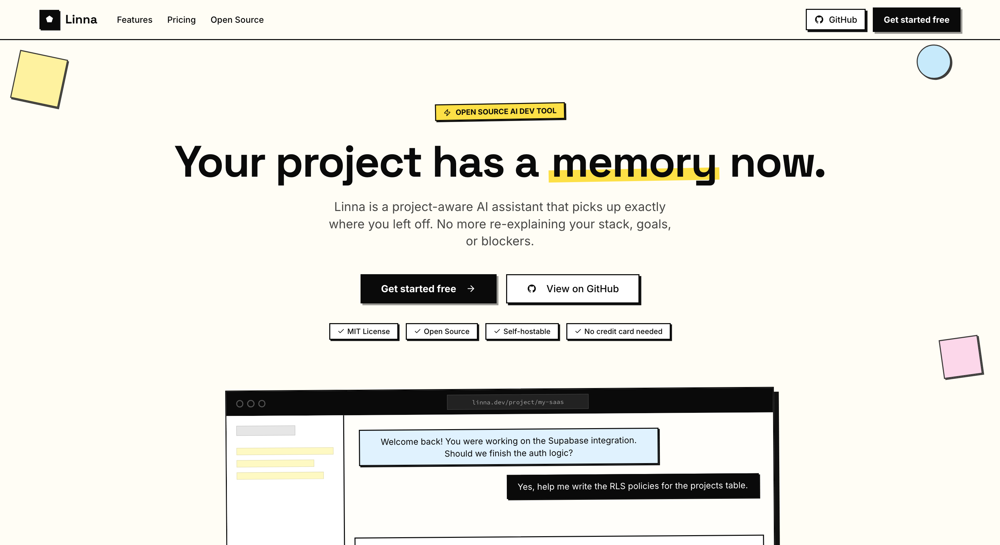

# Linna — Live Intelligent Notes and Navigation Assistant

> **Linna knows your project. ChatGPT doesn't.**

Linna is an open-source, project-aware AI assistant built for indie developers and solo builders. Set up your project once — paste your README, tech stack, goals, and blockers — and every conversation from that point is grounded in your specific context. Linna picks up exactly where you left off.

_ChatGPT is a brilliant stranger. Linna is the co-founder that was there from day one._



---

## The Problem

Every time a dev sits down after a few days away, they waste 30–60 minutes reconstructing context. Generic AI tools have no memory of your project.

- **The Restart Problem** — No tool remembers your project the way you do.
- **The Launch Problem** — Developers know how to build. They don't know how to market or write copy.
- **The Context-Switch Problem** — Between GitHub, docs, Claude, Notion, and Stack Overflow — no single place holds the full picture.
- **The Isolation Problem** — There's no thinking partner. No one to say 'that feature is scope creep.'
- **The Momentum Problem** — Side projects die not from bad ideas, but from losing the thread.

---

## Why Linna

|                             | ChatGPT / Claude.ai | Linna |
| --------------------------- | :-----------------: | :---: |
| Knows your stack            |          ✗          |   ✓   |
| Remembers your decisions    |          ✗          |   ✓   |
| Picks up where you left off |          ✗          |   ✓   |
| Knows your goals            |          ✗          |   ✓   |
| Helps write launch copy     |          ✗          |   ✓   |
| Built for indie devs        |          ✗          |   ✓   |
| Session memory              |          ✗          |   ✓   |
| Open source & self-hostable |          ✗          |   ✓   |

---

## Features (v1)

**Project Setup Onboarding**

- Create a project with name, description, and tech stack
- Paste your README, current goals, known blockers, and target user
- Context stored permanently and powers every AI conversation
- Edit and update as your project evolves

**Context-Aware AI Chat**

- Full-page chat interface, one per project
- Every message sent to the AI with your project context as the system prompt
- Answers grounded in your stack, your decisions, your goals — not generic advice

**Session Memory & History**

- All chat history saved per project in Supabase
- Linna references what was discussed in previous sessions automatically
- Scroll back through past decisions, ideas, and answers anytime

**Launch Assistant**

- Dedicated "Help me launch this" tab inside each project
- Generates Product Hunt post, Reddit launch post, and Twitter/X thread
- Writes a landing page headline and clear value proposition
- Identifies target subreddits and dev communities to post in

**Project Dashboard**

- See all your projects in one clean view
- Last active date, message count, and project status at a glance
- Switch between projects instantly with full context loaded
- Archive completed or paused projects

---

## Pricing

|                    |    Free     | Pro — $12/mo |  Self-Host   |
| ------------------ | :---------: | :----------: | :----------: |
| Projects           |      1      |  Unlimited   |  Unlimited   |
| Messages / month   |     20      |  Unlimited   |  Unlimited   |
| Chat history       | Last 7 days | Full history | Full history |
| Session memory     |      ✗      |      ✓       |      ✓       |
| Launch Assistant   |      ✗      |      ✓       |      ✓       |
| You manage servers |      ✗      |      ✗       |      ✓       |
| Priority support   |      ✗      |      ✓       |      ✗       |

---

## Tech Stack

| Layer      | Tool                                                |
| ---------- | --------------------------------------------------- |
| Frontend   | Next.js 15 (App Router, Turbopack) + Tailwind CSS   |
| AI Layer   | Genkit + Google AI / OpenAI (Vercel AI SDK)         |
| Auth       | Clerk — Google login + email/password               |
| Database   | Supabase (Postgres) — projects, chat history, users |
| Payments   | Stripe — subscription billing for Pro               |
| Deployment | Vercel                                              |

---

## Getting Started (Self-Hosting)

### Prerequisites

- Node.js 18+
- A [Supabase](https://supabase.com/) project
- A [Clerk](https://clerk.com/) application

### Setup

1. Clone the repository:

   ```bash
   git clone https://github.com/sawsimonlinn/linna.git
   cd linna
   ```

2. Install dependencies:

   ```bash
   npm install
   ```

3. Copy the environment file and fill in your credentials:

   ```bash
   cp .env.example .env
   ```

   | Variable                        | Description               |
   | ------------------------------- | ------------------------- |
   | `NEXT_PUBLIC_SUPABASE_URL`      | Your Supabase project URL |
   | `NEXT_PUBLIC_SUPABASE_ANON_KEY` | Your Supabase anon key    |

4. In the Supabase SQL Editor, run the schema:

   ```
   supabase/schema.sql
   ```

5. In Supabase, add the native **Clerk third-party auth integration** for your Clerk domain.

6. In Clerk, enable the **Supabase integration** so Clerk session tokens include the `role: authenticated` claim.

   > If you cannot use the native integration, set `SUPABASE_JWT_TEMPLATE` and create a Clerk JWT template named `supabase` as a fallback.

7. Start the dev server:

   ```bash
   npm run dev
   # Runs on http://localhost:9002
   ```

### AI Development (Genkit)

```bash
npm run genkit:dev
# or with file watching
npm run genkit:watch
```

---

## Scripts

| Command              | Description                            |
| -------------------- | -------------------------------------- |
| `npm run dev`        | Dev server with Turbopack on port 9002 |
| `npm run build`      | Production build                       |
| `npm run start`      | Start the production server            |
| `npm run lint`       | Run ESLint                             |
| `npm run typecheck`  | TypeScript type checking               |
| `npm run genkit:dev` | Start the Genkit AI dev UI             |

---

## Project Structure

```
src/
├── ai/
│   ├── flows/          # Genkit AI flows (chat, launch content, next actions)
│   └── genkit.ts       # Genkit configuration
├── app/
│   ├── (app)/          # Authenticated app routes (dashboard, project, settings)
│   ├── api/projects/   # REST API routes for projects, messages, tasks
│   ├── pricing/        # Pricing page
│   └── page.tsx        # Landing page
├── components/         # Shared UI components (shadcn/ui)
├── lib/
│   ├── projects/       # Project types and data mappers
│   └── supabase/       # Supabase client helpers
└── middleware.ts        # Clerk auth middleware
```

---

## Roadmap (Post-MVP)

| Feature            | Description                                                                          |
| ------------------ | ------------------------------------------------------------------------------------ |
| GitHub Integration | Connect your repo. Linna reads your actual code, not just your description.          |
| Daily Standup Mode | Every morning: "Here's where you left off. Here's what to do today."                 |
| Idea Validator     | Tell Linna a feature idea. It validates it, roasts it, or tells you to ship it now.  |
| Co-founder Mode    | Simulates a non-technical co-founder asking the hard questions.                      |
| Team Plan          | 2–3 devs on the same project. Shared context, shared history.                        |
| AI Code Review     | Paste a function. Linna reviews it in the context of your full project architecture. |

---

## Open Source Strategy

Linna's full codebase is public on GitHub under the MIT License. Anyone can clone it, self-host it, and run their own instance. The hosted version at [linna.dev](https://linna.dev) is where the business lives — no setup, no servers, just sign up and go.

---

## License

MIT License — see [LICENSE](LICENSE) for details.

© 2026 Code Heaven Studio LLC. Built by [Saw Simon Linn](https://github.com/sawsimonlinn).
